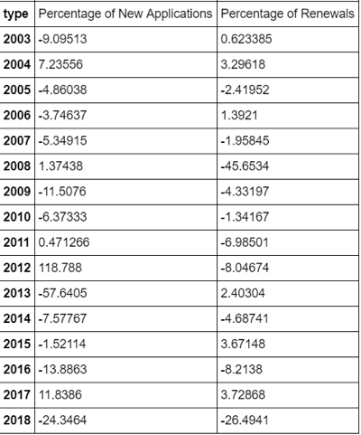
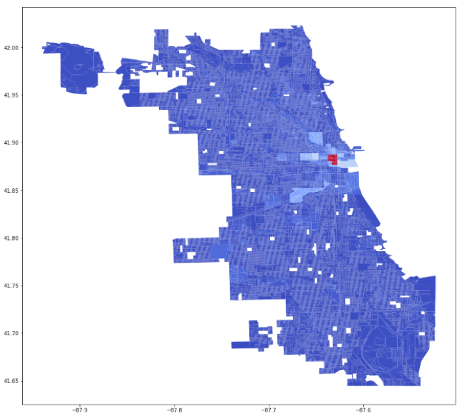
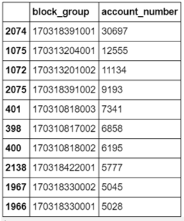
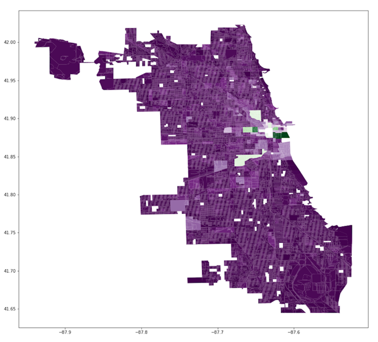
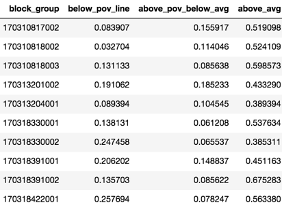
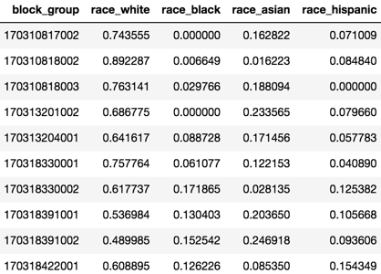

# Promoting Sustained Entrepreneurship in Chicago
Machine Learning for Public Policy
University of Chicago, CS & Harris School of Public Policy

## Collaborators
* Dr. Rayid Ghani (@rayidghani)
* Katy Koenig (@katykoenig)
* Eric Langowski (@erhla)
* Patrick Lavallee Delgado (@lavalleedelgado)

## Background

Healthy businesses mean healthy communities. Yet, with limited resources available to the City that exceed the support its emerging entrepreneurs need, how can policymakers prioritize where and to whom Chicago offer this assistance?

This policy decision has real consequences. An unhealthy business community can lead to negative outcomes for neighborhoods and negative externalities for the city, including reinvestment in neighborhood real estate, infrastructure, services, and human capital. Chicago’s declining population and tax base force a series of policy decisions on where to cut resources and from whom. Alongside the longstanding narratives of segregation and racial inequity in Chicago, these decisions compound structural and systematic under- and disinvestment in Chicago’s communities of color. People of color own only 32% of businesses in Chicago while only 32% of Chicago’s population identify as non-Hispanic White. We aim to offer actionable analysis and policy recommendations that equip the City to improve the state of entrepreneurship and position traditionally underinvested communities towards sustainable business growth.

## Interventions

The City of Chicago believes it can encourage new and sustainable entrepreneurship by lowering the startup costs that business owners face in pursuing their ventures. Interventions available to the City include property tax relief and real estate development grants, both of which would subsidize the initial capital investment businesses require to open new offices and storefronts. Today, the City uses less targeted methods such as grant programs with open calls for proposals, Tax Increment Financing (TIF) Districts, Opportunity Zones, and Transit-Oriented Development.

## Limitations

Of course, municipal resources are limited, and their distribution must consider ethical issues of bias and fairness. Especially for the unbalanced proliferation of business across Chicago – many businesses are in the Loop and some areas of the city have had no new businesses open in the last few years – the City must decide how its entrepreneurship initiative addresses systemic inequality while intervening responsibly.

## Policy recommendations

We believe the City can invest in entrepreneurship that also elevates the economic experiences of its constituents. Adopting the neighborhood approach to development, the City should direct its real estate capital resources to new businesses opening on blocks that, based on evidence shown elsewhere in the city, are more likely to contribute to their longevity.

## Data

Using the City’s business license data from the Department of Business Affairs and Consumer Protection, we can identify the location and block characteristics of businesses that are less likely to fail, which we deduce from license renewal history. Demographic data from the American Community Survey from the US Census Bureau let us characterize Chicago at the block level. The City’s 311 data allows us to assess the quality of life on a block per the frequency of service requests.
 
We must note that business license approvals and renewals also depend on the national economic outlook. The table below shows a striking change in applications and renewals during the 2008 financial crisis.

Another distributive factor in the business data is geographic concentration. Block group 170318391001 (part of the Loop) has almost 31,000 unique business from 2003 to 2018, eclipsing all other Chicago blocks.

The second choropleth below excludes the one block group with the highest to number of new businesses licenses from 2015 to 2018 in order to show the differences in more modest growth throughout the city. As we can see in this image, there is slightly more diversity of growth among block groups, yet it remains concentrated around the downtown area. 

The charts below document the demographic details of the top ten block groups with highest rate of new issue and renewal business license applications. As we can see in these charts, block groups experiencing both growth and stability do not reflect the overall demographics of the city. Instead, these block groups tend to be high income – with most of the top ten block groups having income at least 52% above the Illinois state average – and almost all have populations with more than 50% white residents. The lack of racial and economic diversity in these block groups reflect the lack of resources and amenities available to lower income residents and residents of color. 

## Analysis, caveats, and evaluation

Our analysis will rank Chicago’s census blocks by its potential to sustain new ventures, a metric we construct from a block’s similarity to others that have seen businesses last more than two years. We superimpose this ranking with indicators of socioeconomic diversity to identify those blocks that also further the City’s commitment to developing struggling neighborhoods. This analysis would allow the city to maximize the impact of its limited resources for intervention. The analysis evaluates several supervised learning models – support vector machine, logistic regression, decision trees, among others – to identify a model that allows us offer deeper insight.

Validation priorities include reshaping the analysis to better capture that different kinds of business licenses have different issue and expiration dates, as well as to account for businesses that move and reestablish themselves elsewhere in the city. This requires evaluating the data along these axes of interest throughout time. We also need to reinforce the validity of the model for all of Chicago as well as the socioeconomically diverse neighborhoods we intend to support specifically. This distinction is critical, considering the low dimensionality of many of our data sources, that our model does not suffer statistical bias from other unobserved factors.

Lastly, our analysis will not be without its limitations. The City’s business license has low dimensionality. Data does not have demographic information of its licensees, so while we can suggest blocks in socioeconomically diverse neighborhoods, there is no indication of whether the entrepreneurs who benefit from intervention are themselves representative of those communities. Other factors contribute to the success of a business, particularly its business model and management; these may correlate with the level of education of the business owner, and other identifying characteristics that do not exist in the dataset. Also, our recommendations would only assist businesses with physical locations, which does not consider today’s telecommuter organizations.

